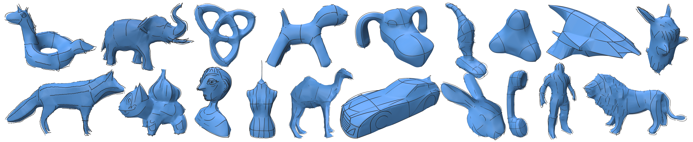

<div align="center">

<h1>NeuralSketch2Surf</h1>

<h3>Fast Neural Surfacing of Unoriented 3D Sketches</h3>

<p><strong>SIGGRAPH 2026 / ACM Transactions on Graphics</strong></p>

<sub>
Hongsheng Ye<sup>*1</sup> &nbsp;&middot;&nbsp;
Anandhu Sureshkumar<sup>*1</sup> &nbsp;&middot;&nbsp;
Zhonghan Wang<sup>1</sup> &nbsp;&middot;&nbsp;
Marie-Paule Cani<sup>2</sup>
<br>
Stefanie Hahmann<sup>3</sup> &nbsp;&middot;&nbsp;
Georges-Pierre Bonneau<sup>3</sup> &nbsp;&middot;&nbsp;
Amal Dev Parakkat<sup>1</sup>
<br>
<sup>1</sup>LTCI, Telecom Paris, Institut Polytechnique de Paris
<br>
<sup>2</sup>LIX, Ecole Polytechnique/CNRS, Institut Polytechnique de Paris
<br>
<sup>3</sup>Univ. Grenoble Alpes, CNRS, INRIA, Grenoble INP, LJK
<br>
<sup>*</sup>Equal contribution
</sub>

<br>
<br>

<p>
  <a href=".">Paper</a> &nbsp; | &nbsp; <a href="https://files.atypon.com/acm/6040d3e9ff1fa05cc0a67e40eb4c942c">Video</a> &nbsp; | &nbsp; <a href="https://huggingface.co/spaces/HongshengY/NeuralSketch2Surf-Demo">Demo Website</a> &nbsp; | &nbsp; <a href="#2-download-model-weights">Model</a>
</p>


</div>

NeuralSketch2Surf reconstructs smooth, closed surfaces from sparse and unoriented 3D sketches. The method predicts a volumetric occupancy proxy with S2V-Net, extracts a mesh using Marching Cubes, and provides an interactive fidelity-vs-smoothness control for the final surface. The full pipeline is designed for interactive use, producing results in around 0.6 seconds in the paper examples and under 2 seconds across tested inputs.


## Highlights

- **Unoriented sketch input.** The method processes raw 3D strokes without normals, stroke ordering, ribbons, or user-provided proxy geometry.
- **S2V-Net architecture.** A modified SwinUNETR V2 backbone captures long-range relationships between sparse strokes, followed by a lightweight 3D residual refinement network.
- **Stable voxel proxy.** Sketch-to-surface reconstruction is formulated as binary occupancy prediction on a `112^3` grid, enabling fast inference and robust topology.
- **Synthetic sketch supervision.** The data pipeline generates paired sparse geodesic sketches and dense occupancy labels from closed manifold meshes.
- **Controllable surfacing.** A dedicated smoothing tool interpolates between high sketch fidelity and smoother geometry with a single user-facing parameter.

## Pipeline

The system follows a simple, deployable pipeline:

1. Voxelize the input 3D sketch.
2. Predict an occupancy field with S2V-Net.
3. Extract a proxy surface using Marching Cubes.
4. Smooth, align, and repair the mesh with the fidelity-vs-smoothness interface.


S2V-Net combines:

- a custom SwinUNETR V2 backbone for coarse occupancy prediction;
- trilinear decoder upsampling in place of transposed convolution to reduce artifacts on sparse inputs;
- a compact residual refinement module that learns local corrections;
- Dice-WBCE and total-variation losses for class imbalance, topological consistency, and smoother probability fields.

## Results

**Hand-drawn / VR sketches**


**SurfaceBrush sketches**


**Cross-dataset examples**



The paper reports strong geometric and topological behavior on unoriented sketches, including the best Hausdorff distance, normal consistency, aspect ratio, and Betti-0 success rate among the evaluated unoriented surfacing baselines. NeuralSketch2Surf is designed for closed-surface reconstruction; open surfaces and isolated decorative strokes are outside the current scope.

## Repository Layout

```text
NeuralSketch2Surf/
|-- network/                     # S2V-Net backbone and refinement network
|-- synthetic_data/              # Synthetic geodesic sketch and voxel label pipeline
|-- data/                        # Sample meshes and sample 112^3 sketch dataset
|-- tools/                       # Sketch cleaning, ribbon conversion, and figures
|-- inference.py                 # CUDA/CPU inference from OBJ sketches
|-- inference_pointcloud.py      # Point-cloud OBJ inference variant
|-- inference_MultiModel.py      # Multi-model inference utility
|-- smooth.py                    # Interactive mesh smoothing and repair
`-- train112TVloss.py            # PyTorch Lightning training script
```

## Quick Start

### 1. Create the environment

```bash
conda create -n neuralsketch2surf python=3.9
conda activate neuralsketch2surf
pip install -r requirements.txt
```

Install the PyTorch build that matches your CUDA driver if the pinned version in `requirements.txt` is not suitable for your machine.

Some geometry utilities import `igl`. If it is not available in your environment, install the Python libigl package:

```bash
pip install libigl
```

### 2. Download model weights

Pretrained weights are not stored in this repository. You can download it here: [Download](https://huggingface.co/HongshengY/S2V_Net) . 
After downloading a released checkpoint, place it under:

```text
checkpoints/best_model_jit.pt
```

Both TorchScript `.pt` and PyTorch Lightning `.ckpt` checkpoints are supported by the inference scripts.

### 3. Run inference

Input sketches are expected as OBJ files containing vertices and line elements. The script also accepts OBJ faces and converts their edges to sketch curves.

```bash
python inference.py \
  --model_path checkpoints/best_model_jit.pt \
  --input_dir data/sketch_dataset_112/geo \
  --output_dir results \
  --threshold 0.6 \
  --img_size 112 \
  --margin 1.2
```

For each input sketch, the script writes:

- `{name}_recon.obj`: reconstructed mesh;
- `{name}_data.npz`: probability grid, alignment metadata, Marching Cubes vertices/faces, and timing information.

### 4. Smooth the reconstructed mesh

```bash
python smooth.py path/to/sketch.obj path/to/reconstruction_mesh.obj
```

The Polyscope interface exposes:

- **Fidelity vs Smooth**: move toward `1.0` to adhere more closely to the sketch, or toward `0.0` for a smoother result;
- **Take Custom Screenshot**: save the current viewport;
- **Reset Rotation/Position**: reset manual transforms;
- **Export & Repair Mesh**: export `{name}_smooth.obj` after hole filling, cleanup, normal repair, and Taubin smoothing.

## Data

The training data is synthesized from closed manifold meshes. The paper uses 1,519 meshes collected from:

- [Greyc3D Colored Mesh Dataset](https://downloads.greyc.fr/Greyc3DColoredMeshDatabase/)
- [SHREC07 Watertight Models](https://segeval.cs.princeton.edu/)
- [SHREC15](https://www.icst.pku.edu.cn/zlian/representa/3d15/dataset/index.htm)

For each shape, the dataset generator creates multiple random geodesic sketch variants with different curve counts and lengths, then voxelizes both the sketch and the ground-truth solid shape.

The repository includes a small sample under `data/sketch_dataset_112/`. See [data/README.md](data/README.md) for the expected data structure and file formats.


## Generate Synthetic Data

Place closed manifold OBJ meshes in:

```text
data/original_meshes/
```

Then run:

```bash
python synthetic_data/pipeline.py \
  --n_curves 25 \
  --len_percent 80 \
  --farthest
```

The pipeline performs:

1. geodesic curve generation;
2. solid label voxelization;
3. sketch curve voxelization aligned to the same `112^3` grid.

## Training

```bash
python train112TVloss.py \
  --data_dir data/sketch_dataset_112 \
  --save_dir checkpoints \
  --img_size 112 \
  --batch_size 4 \
  --max_epochs 150 \
  --lr 2e-4 \
  --wce_weight 0.5 \
  --tv_weight 0.1 \
  --num_workers 6 \
  --dropout 0.3 \
  --gpus 2 \
  --project NeuralSketch2Surf \
  --name 112_TVloss
```

Training uses PyTorch Lightning, AdamW, Dice-WBCE loss, total-variation regularization, object-level train/validation splitting, and exports the best checkpoint as a TorchScript deployment model at:

```text
checkpoints/best_model_jit.pt
```

The paper training setup used two NVIDIA A100 40GB GPUs for 150 epochs.

## Tools

### Interactive sketch cleaner

```bash
python tools/SketchEditor.py
```

This Polyscope tool removes noisy or unwanted curve segments from `.ply` sketch files and exports cleaned sketches.

### RibbonSculpt-to-sketch converter

```bash
python tools/ConvertRibbonToSketch.py
```

This utility converts ribbon-style meshes, such as VR sketch ribbons, into lightweight centerline `.ply` curve networks.

See [tools/README.md](tools/README.md).

## Notes and Limitations

- NeuralSketch2Surf targets closed surfaces. Open surfaces require boundary information and additional post-processing.
- The current resolution is `112^3`, so very thin gaps or extremely fine separated parts may be limited by voxel resolution.

## Citation

If you find this project useful, please cite:

```bibtex
@article{neuralsketch2surf2026,
  title   = {NeuralSketch2Surf: Fast Neural Surfacing of Unoriented 3D Sketches},
  author  = {Ye, Hongsheng and Sureshkumar, Anandhu and Wang, Zhonghan and Cani, Marie-Paule and Hahmann, Stefanie and Bonneau, Georges-Pierre and Parakkat, Amal Dev},
  journal = {ACM Transactions on Graphics (Proceedings of SIGGRAPH)},
  year    = {2026}
}
```

## Acknowledgements

We thank the MONAI project for the open-source SwinUNETR implementation, which informed the network backbone used in this project: [Project-MONAI/MONAI](https://github.com/Project-MONAI/MONAI/blob/dev/monai/networks/nets/swin_unetr.py).
