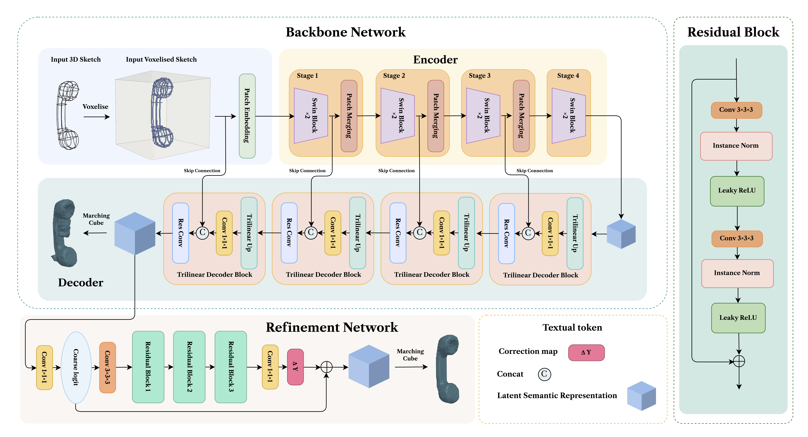

# NeuralSketch2Surf

## Overview

We introduce NeuralS-ketch2Surf, the first fast and robust neural surfacing solution that processes arbitrarily unoriented sketches at interactive rates. Our approach uses a custom-modified transformer network designed to mesh 3D sketches. Instead of directly inferring complex functions to represent shapes, we focus on predicting an occupancy grid, which is then refined using a custom smoothing function to create the desired surface. Thanks to a lightweight architecture that enables fast predictions on a coarse occupancy grid, our method produces results in less than 2 seconds, in contrast to SOTA techniques that can take minutes or even hours. Extensive evaluations demonstrate that our method is not only fast but also generates closed surfaces with high geometric, topological, and perceptual accuracy.


## Architecture




#### Modified Bilinear-Based Upsampling

The file [Network/SwinUNETRV2/blocks/dynunet_block.py] contains a custom implementation that **replaces transposed convolution-based upsampling with linear interpolation upsampling**. This ensures efficient memory usage and avoids artifacts often associated with transpose convolutions, while maintaining accuracy in reconstructing fine geometric details.

## Result


## 📔Data

#### 🗃️Data Sources

We collected 1,519 high-quality closed manifold meshes from three public 3D model repositories:

- [Greyc3D Colored Mesh Dataset](https://downloads.greyc.fr/Greyc3DColoredMeshDatabase/): A comprehensive collection of colored 3D meshes from a variety of objects.
- [SHREC07 Dataset](https://segeval.cs.princeton.edu/): Provides high-quality 3D models widely used for benchmark tasks in computer graphics and geometry processing.
- [SHREC15 Dataset](https://www.icst.pku.edu.cn/zlian/representa/3d15/dataset/index.htm): Offers 3D meshes with annotations for various tasks like part segmentation, classification, etc.

Make sure to acquire datasets from the above links and place them appropriately in the `Data/` folder as outlined below.<br>
✨It is worth noting that this project did not utilize all the 3D models from the aforementioned links. We made a selection.

#### 🗂️Training Data Synthesis
The pipeline includes:
1. **Geodesic Curve Generation**: Stage 1 allows exporting geodesic curves in `.obj` format.
2. **Label Voxelization**: Converts 3D meshes into voxelized labels.
3. **Geodesic Voxelization**: Allows high-fidelity representation of geodesics in voxelized grids.


## 🛠️ Dependencies

To run this project, ensure you have the following installed:

- **Python** (3.9)
- **PyTorch** (2.8.0) with CUDA 12 support
- **3D Libraries**: 
  - Open3D
  - Trimesh
  - libigl (igl)
  - Polyscope
- **Deep Learning Frameworks**:
  - PyTorch Lightning
  - MONAI
- **Logging & Visualization**:
  - WandB (Weights & Biases)
  - Matplotlib / Plotly
- **Other Scientific Libraries**: `numpy`, `scipy`, `scikit-image`, `scikit-learn`, `pandas`, `tqdm`.

#### Installation

You can install the dependencies using the provided requirements file:

```bash
pip install -r requirements.txt
```


## 🚀Usage

### 1. Generate Synthetic 3D Data
Use the `SyntheticData/pipeline.py` script to prepare the geodesics and voxelized datasets:

```bash
python SyntheticData/pipeline.py --n_curves 25 --len_percent 80
```

### 2. Train the Model
Run the training script with your dataset (e.g., saved in `Data/Sketch_Dataset_112`):

```bash
python /train112TVloss.py \
    --data_dir /Data/Sketch_Dataset_112 \
    --save_dir /checkpoint\
    --img_size 112 \
    --batch_size 4 \
    --max_epochs 150 \
    --lr 2e-4 \
    --wce_weight 0.5 \
    --tv_weight 0.1 \
    --num_workers 6 \
    --dropout 0.3 \
    --gpus 2 \
    --project "Sketch_TV_Loss2" \
    --name "112_ TVloss"
```

### 3. Run Inference
Perform predictions on unseen `.obj` files and save reconstructed meshes:

```bash
python inference.py --model_path checkpoints/best_model.ckpt --input_dir your_input_dir --output_dir results --threshold 0.6
```

