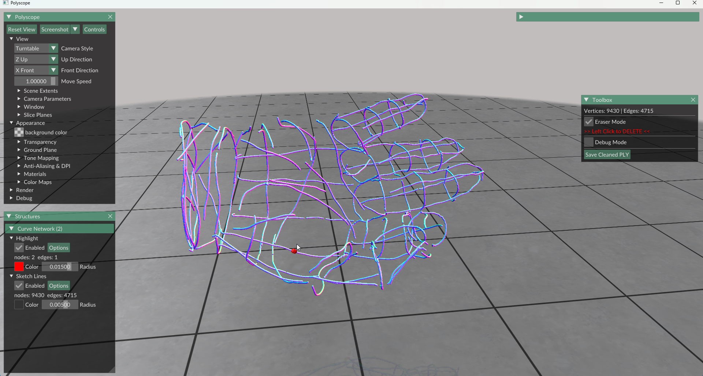
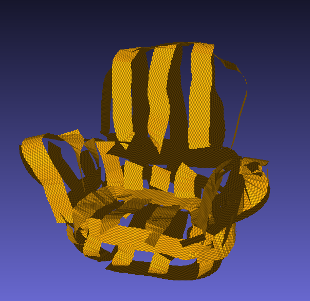
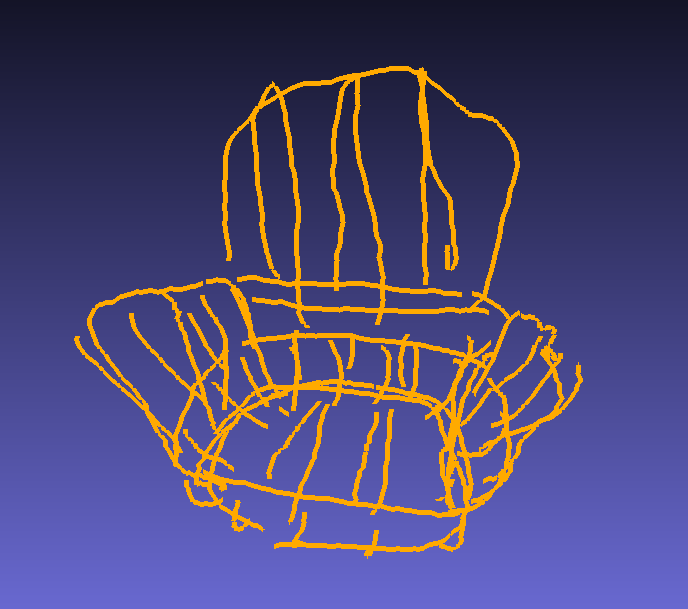

# 1. Interactive 3D Sketch Cleaner

A lightweight, interactive tool built with [Polyscope](https://polyscope.run/) for cleaning 3D curve networks (sketches). This tool provides a visual interface to manually remove unwanted segments or noise from `.ply` files with precision.




## 📖 Overview

When working with 3D generative sketches or raw scan data, curve networks often contain noise, floating artifacts, or incorrect connections. This tool allows users to visualize the sketch and use an "Eraser" tool to interactively prune the data before processing it further.

## ✨ Features

*   **Real-time Visualization**: Navigate your 3D sketch comfortably using the Polyscope interface.
*   **Eraser Mode**: A dedicated toggleable mode for editing.
*   **Visual Feedback**: A **Red Dot** indicator follows the mouse cursor along the curve geometry, showing exactly where an operation will occur.
*   **Precision Editing**:
    *   **Left Click** on the highlighted red dot to delete segments.
    *   Allows for cutting long lines or removing entire isolated segments.
*   **One-Click Export**: Save the cleaned geometry as a new `.ply` file in the original directory.

## 🛠️ Dependencies

This project relies on Python and the following libraries:

*   **Polyscope** (for the GUI and rendering)
*   **NumPy** (for data manipulation)

To install the requirements, run:

```bash
pip install polyscope numpy
```

## 🚀 Usage

**1.Run the Script:**<br>
Start the tool by running your python script:

```bash
python SketchEditor.py
```
(Note: Ensure your input .ply file is loaded correctly in the code)

**2.Enable Eraser Mode:**<br>
Look at the Toolbox panel on the right side of the screen. Check the box labeled:<br>
✅ Eraser Mode

**3.Delete Lines:**
* Move your mouse over the 3D curves.
* You will see a Red Dot snapping to the curve lines.
* Left Click to delete the specific segment under the red dot.

**4.Save Results:**
* Once you are satisfied with the cleanup, click the "Save Cleaned PLY" button in the Toolbox.
* A new file will be saved in the same directory (e.g., filename_cleaned.ply).


# 2. RibbonSculpt to Sketch Path Converter

A Python utility that batch converts ribbon-style 3D meshes (commonly created in VR sketching tools or modeling software) into lightweight, centerline curve networks.

## 📸 Comparison

| **Before (Ribbon Mesh)** | **After (Extracted Sketch)** |
| :---: | :---: |
|  |  |
| *Original ribbon geometry* | *Centerline edge paths* |

## ✨ Features

*   **Batch Processing**: Automatically converts all models in a specified folder.
*   **Algorithm**:
    *   Identifies connected triangular faces.
    *   Calculates midpoints of shared edges between faces.
    *   Connects midpoints to form continuous polyline paths.
*   **Output**: Saves results as standard ASCII `.ply` files (vertices + edges) with a `_convert` suffix.

## 🚀 Usage

**1.Configure Paths:**<br>
Open the script and locate the configuration section at the bottom. Modify the INPUT_DIR to point to your folder containing the ribbon meshes.

**2.Run the Script:**<br>

```bash
python ConvertRibbonToSketch.py
```

**3.Check Results:**
The script will create a new folder (default: Convert_result_ply) inside your input directory containing the converted .ply files.