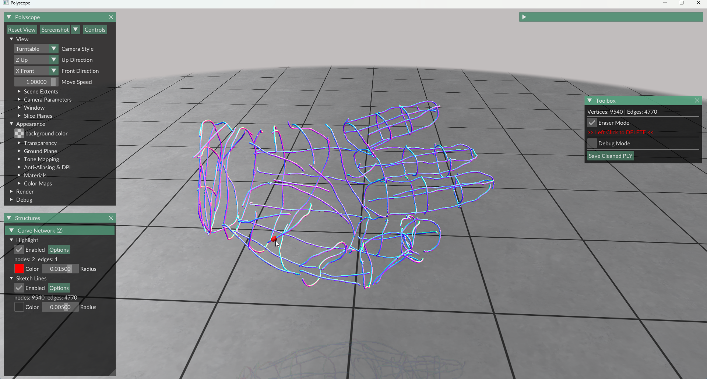

# Tools

This folder contains small utilities used around the NeuralSketch2Surf pipeline: cleaning raw curve sketches and converting ribbon-style VR sketches into curve networks.

## 1. Interactive 3D Sketch Cleaner

`SketchEditor.py` is a Polyscope-based editor for pruning noisy 3D curve networks stored as ASCII PLY files. It is useful for cleaning raw sketches before reconstruction.

| Interface | After deleting segments |
| :---: | :---: |
|  |  |

### Input and Output

- **Input:** `.ply` file with vertices and edges.
- **Output:** `{input_name}_cleaned.ply` in the same directory.
- **Main interaction:** enable eraser mode, hover over an edge, and left-click to delete it.

### Usage

From the repository root, pass the sample path explicitly:

```bash
python tools/SketchEditor.py tools/sample/hand.ply
```

## 2. RibbonSculpt to Sketch Path Converter

`ConvertRibbonToSketch.py` converts ribbon-like 3D meshes into lightweight centerline curve networks.
| Ribbon mesh | Extracted sketch |
| :---: | :---: |
|  |  |

### Input and Output

- **Input:** folder of `.glb`, `.gltf`, `.obj`, `.stl`, or `.ply` ribbon meshes.
- **Output:** ASCII PLY curve files with a `_convert.ply` suffix.
- **Default output folder:** `Convert_result_ply/` inside the input folder.

### Usage

The script currently uses a configuration block at the bottom of the file. The sample paths are relative to `tools/`, so run:

```bash
cd tools
python ConvertRibbonToSketch.py
```

By default, it processes:

```text
tools/sample/RibbonSculpt/
```

and writes converted curves to:

```text
tools/sample/RibbonSculpt/Convert_result_ply/
```

To use your own data, edit the `INPUT_DIR` and `OUTPUT_DIR` variables near the bottom of `ConvertRibbonToSketch.py`.

### Method

For each connected ribbon component, the converter:

1. loads the mesh with Trimesh;
2. merges nearby duplicate vertices after coordinate rounding;
3. finds adjacent triangle pairs;
4. places centerline samples at shared-edge midpoints;
5. connects nearby midpoint samples into PLY edge paths.

This is a lightweight conversion heuristic. It works best for clean ribbon strokes with consistent strip width and connected triangle topology.

## Practical Notes

- Run GUI tools in an environment with display support. Polyscope opens an interactive window.
- Keep curve files lightweight. Very dense raw sketches can be cleaned or simplified before inference.
- The converter and cleaner operate on curve representations only; they do not run NeuralSketch2Surf reconstruction.
- For reconstruction after cleaning or conversion, feed OBJ sketches to `inference.py`. Convert PLY curves to OBJ lines if needed.
